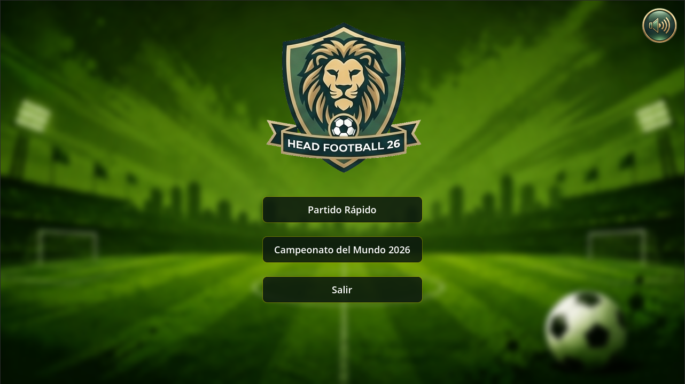
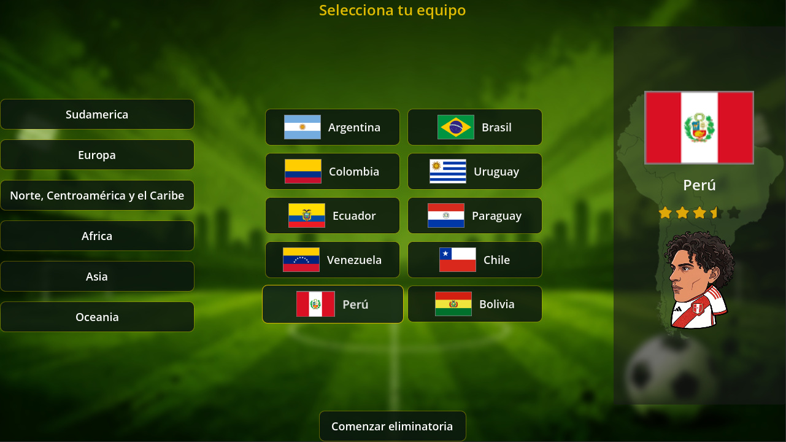
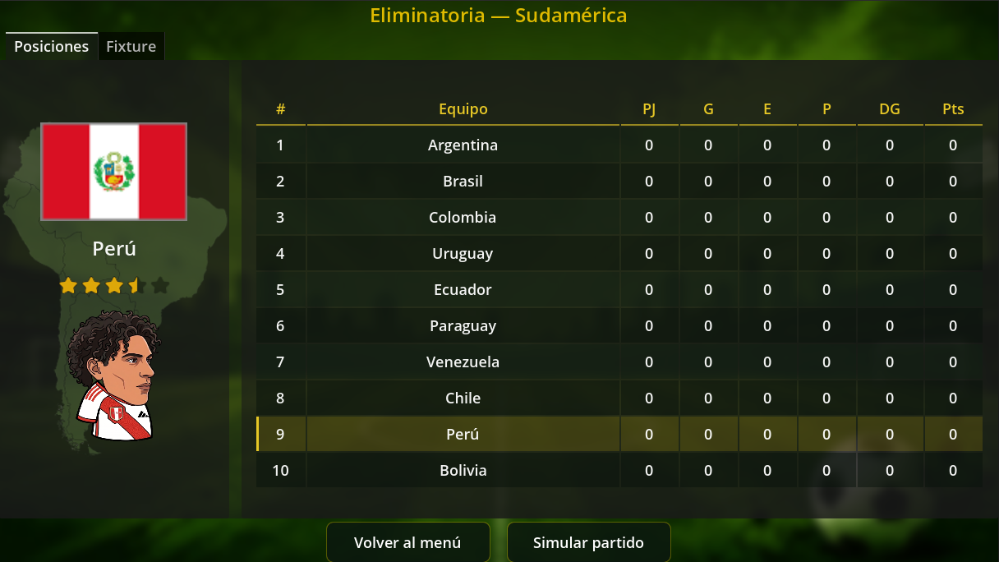
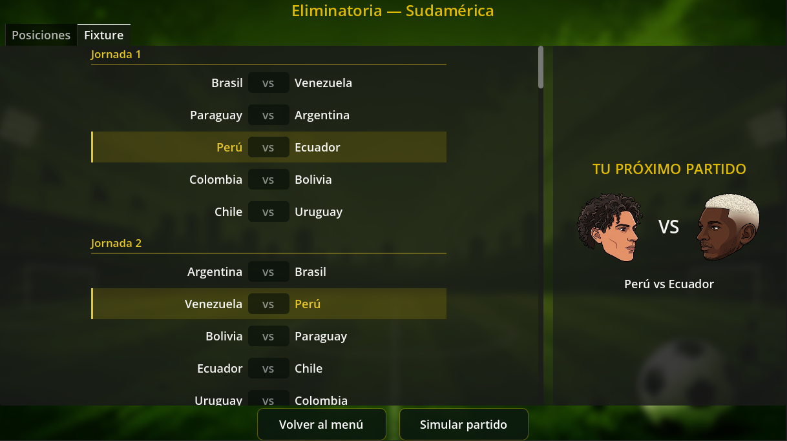
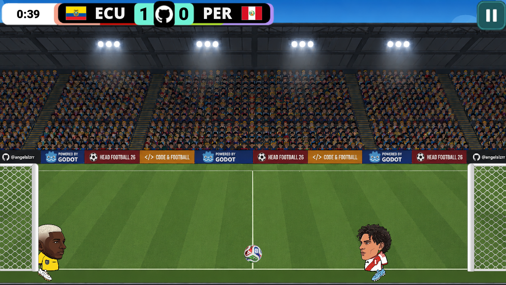
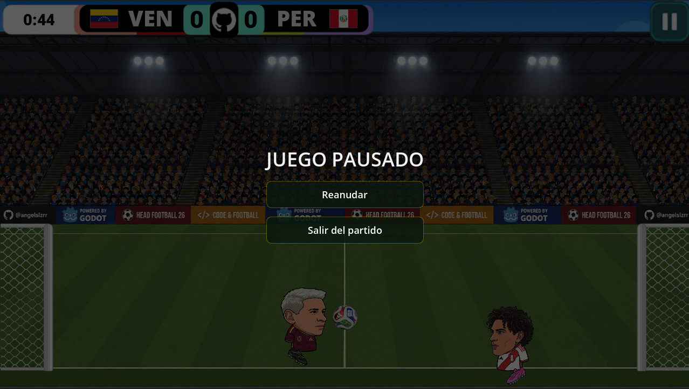

# Head Football 26 🏆⚽

Un videojuego de fútbol 2D estilo arcade, fuertemente inspirado en los clásicos juegos de navegador como *dvadi.com (Football Heads)*, pero traído a la era moderna con la temática de las eliminatorias y la Copa del Mundo 2026. 

Desarrollado en **Godot 4** usando **C#**.

## 🧠 La Filosofía de Desarrollo: Vibe Coding y Arquitectura
Este proyecto fue construido utilizando una metodología de **Vibe Coding** (Programación impulsada por IA). 

La mayor parte del código duro, la sintaxis en C# y las interacciones nativas de Godot fueron generadas en colaboración con modelos de IA (Gemini y Claude). Sin embargo, la **dirección arquitectónica, la aplicación de principios de Programación Orientada a Objetos (POO), la lógica de estados y la corrección de bugs lógicos** fueron orquestados de forma manual (apoyado en la IA). Este repositorio es un testimonio de cómo los fundamentos sólidos de ingeniería de software permiten dirigir herramientas de IA para construir productos completos, escalables y bien estructurados, incluso sin ser un experto nativo en un lenguaje o motor específico.

## 🎨 Arte y Diseño Visual
Siguiendo la misma filosofía híbrida, los recursos gráficos del juego fueron creados combinando IA generativa y edición manual:
* Las cabezas de los jugadores (estilo caricatura/cabezón), las camisetas, los chimpunes, los fondos de los menús y los botones fueron diseñados inicialmente por inteligencia artificial.
* Todo el trabajo de post-producción, recorte de fondos, ajuste de dimensiones, superposición de capas y estandarización visual se realizó a mano utilizando **Photopea**.

## 🎮 Modos de Juego e Interfaces

### 1. Menú Principal (`MainMenu.tscn`)
La puerta de entrada al juego. Cuenta con un sistema persistente de guardado de configuración de audio (volumen) y detecta automáticamente si hay un torneo en curso para ofrecer un acceso rápido mediante una elegante tarjeta superpuesta.
**

### 2. Selección de Equipos (`SelectionMenu.tscn`)
Un menú de selección premium donde el jugador puede filtrar equipos por confederación. Al elegir un país, la pantalla se divide para mostrar un panel de detalles con la bandera, las estrellas de valoración de la plantilla, un mapa silueta de la región y la previsualización del jugador estrella armado dinámicamente por capas.
**

### 3. Centro de Torneo (`TournamentHub.tscn`)
El corazón del modo campaña. Administra el estado global de la eliminatoria. 
* **Pestaña Posiciones:** Una tabla dinámica que ordena a los equipos, resalta al equipo del jugador y diferencia las filas con un estilo visual de colores alternados.
* **Pestaña Fixture:** Genera un calendario *Round-Robin* ida y vuelta. Incluye una tarjeta gráfica de "La Previa" que pone cara a cara al jugador estrella de tu equipo contra el de tu próximo rival.
**
**

### 4. Gameplay (`Cancha.tscn`)
Físicas 2D personalizadas para emular la jugabilidad clásica de *Head Soccer*. 
El motor físico cuenta con:
* Sensibilidad de impacto: El balón reacciona de forma diferente si el jugador lo golpea en el aire, corriendo o saltando.
* Una Inteligencia Artificial reactiva que calcula trayectorias mediante ecuaciones cinemáticas, aplica estados de pánico defensivo y comete errores humanos según su valoración de estrellas.
**

### 5. Menú de Pausa (`MenuPausa.tscn`)
Un menú in-game que pausa el árbol de procesos de Godot. Si el jugador abandona un partido oficial de eliminatoria, el sistema aplica una derrota por "Walkover" (0-3) para mantener la integridad del torneo.
**

## 🚀 Roadmap (Próximos Pasos)
La arquitectura del juego (como el `RepositorioEquipos` y `TeamData`) está construida para ser altamente escalable. Los próximos hitos del proyecto incluyen:
- [ ] Agregar equipos de la UEFA.
- [ ] Agregar equipos de CONCACAF, CAF, AFC y OFC.
- [ ] Implementar la Fase Final de Grupos y Eliminatorias de la Copa del Mundo 2026.
